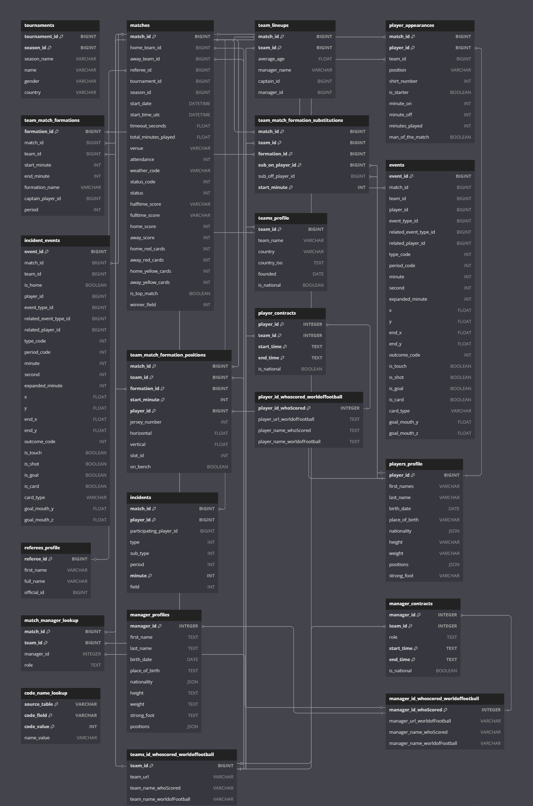

# Large-Scale Soccer Action-Level Dataset
This is a database for research purposes only and includes 22 tables with detailed information about matches, tournaments, players, teams, and match events, among others. The event data tracks various on-field actions such as passes, shots, goals, substitutions, fouls, cards, and other key game events, each with timestamps and spatial coordinates. As such, this database captures unique large-scale granular action-level data.

Match and Tournament Data was scraped from _WhoScored.com_ while players, teams, and managers data was scraped from _worldofootball.com_. Both datasets were then matched using a custom algorithm. 

## Overview
This dataset comprises **27,229 matches** from season 2009/2010 until 2023/2024 from all top 5 European soccer leagues (Premier League, La Liga, Bundesliga, Serie A, and Ligue 1).
Further, it includes person characteristics and contract data covering **14,265 players**, **678 managers** and **35,537 teams**
## Entity-Relationship-Diagram

## Table Details

### 1. Tournaments, Match Data, Formations, and Events

<strong>tournaments</strong>

| Column | Type | Example Value | Primary Key | Foreign Key |
|--------|------|--------------|-------------|-------------|
| tournament_id | BIGINT | 2 | ✓ | - |
| season_id | BIGINT | 1849 | ✓ | - |
| season_name | VARCHAR | 2009/2010 | - | - |
| name | VARCHAR | Premier League | - | - |
| gender | VARCHAR | Male | - | - |
| country | VARCHAR | GB | - | - |

<strong>matches</strong>

| Column | Type | Example Value | Primary Key | Foreign Key |
|--------|------|-----|-------------|-------------|
| match_id | BIGINT | 318043 | ✓ | - |
| home_team_id | BIGINT | 96  | - | teams_id_whoscored_worldoffootball.team_id |
| away_team_id | BIGINT | 170 | - | teams_id_whoscored_worldoffootball.team_id |
| referee_id | BIGINT | 90  | - | referees_profile.referee_id |
| tournament_id | BIGINT | 2   | - | - |
| season_id | BIGINT | 1849 | - | - |
| start_date | DATETIME | 2010-01-05 | - | - |
| start_time_utc | DATETIME | 2010-01-05T19:45:00Z | - | - |
| timeout_seconds | FLOAT | 0.0 | - | - |
| total_minutes_played | FLOAT | 99.0 | - | - |
| venue | VARCHAR | Britannia Stadium | - | - |
| attendance | INT | 0   | - | - |
| weather_code | VARCHAR | NULL | - | - |
| status_code | INT | 6   | - | - |
| status | INT | 6   | - | - |
| halftime_score | VARCHAR | 3 : 0 | - | - |
| fulltime_score | VARCHAR | 3 : 2 | - | - |
| extratime_score | VARCHAR | 5:4 | - | - |
| penalty_score | VARCHAR | 3:2 | - | - |
| home_score | INT | 3   | - | - |
| away_score | INT | 2   | - | - |
| home_red_cards | INT | 0   | - | - |
| away_red_cards | INT | 0   | - | - |
| home_yellow_cards | INT | 1   | - | - |
| away_yellow_cards | INT | 0   | - | - |
| is_top_match | BOOLEAN | 0   | - | - |
| winner_field | INT | 0   | - | - |

<strong>team_lineups</strong>

| Column | Type | Example Value | Primary Key | Foreign Key |
|--------|------|--------------|-------------|-------------|
| match_id | BIGINT | 317783 | ✓ | matches.match_id |
| team_id | BIGINT | 32 | ✓ | teams_id_whoscored_worldoffootball.team_id |
| average_age | FLOAT | 41.1 | - | - |
| manager_name | VARCHAR | Alex Ferguson | - | - |
| captain_id | BIGINT | NULL | - | - |
| manager_id | BIGINT | 29 | - | - |

<strong>player_appearances</strong>

| Column | Type | Example Value | Primary Key | Foreign Key |
|--------|------|--------------|-------------|-------------|
| match_id | BIGINT | 317783 | ✓ | matches.match_id |
| player_id | BIGINT | 11530 | ✓ | players_profile.player_id |
| team_id | BIGINT | 32 | - | teams_id_whoscored_worldoffootball.team_id |
| position | VARCHAR | GK | - | - |
| shirt_number | INT | 12 | - | - |
| is_starter | BOOLEAN | 1 | - | - |
| minute_on | INT | 0 | - | - |
| minute_off | INT | 94 | - | - |
| minutes_played | INT | 94 | - | - |
| man_of_the_match | BOOLEAN | 0 | - | - |

<strong>team_match_formations</strong>

| Column | Type | Example Value | Primary Key | Foreign Key |
|--------|------|--------------|-------------|-------------|
| formation_id | BIGINT | 2 | ✓ | - |
| match_id | BIGINT | 317783 | - | matches.match_id |
| team_id | BIGINT | 32 | - | teams_id_whoscored_worldoffootball.team_id |
| start_minute | INT | 0 | - | - |
| end_minute | INT | 47 | - | - |
| formation_name | VARCHAR | 442 | - | - |
| captain_player_id | BIGINT | 3841 | - | - |
| period | INT | 16 | - | - |

<strong>team_match_formation_positions</strong>

| Column | Type | Example Value | Primary Key | Foreign Key |
|--------|------|--------------|-------------|-------------|
| match_id | BIGINT | 317783 | ✓ | matches.match_id |
| team_id | BIGINT | 32 | ✓ | teams_id_whoscored_worldoffootball.team_id |
| formation_id | BIGINT | 2 | ✓ | team_match_formations.formation_id |
| start_minute | INT | 0 | ✓ | - |
| player_id | BIGINT | 11530 | ✓ | players_profile.player_id |
| jersey_number | INT | 12 | - | - |
| horizontal | FLOAT | 5 | - | - |
| vertical | FLOAT | 0 | - | - |
| slot_id | INT | 1 | - | - |
| on_bench | BOOLEAN | 0 | - | - |

<strong>team_match_formation_substitutions</strong>

| Column | Type | Example Value | Primary Key | Foreign Key |
|--------|------|--------------|-------------|-------------|
| match_id | BIGINT | 317783 | ✓ | matches.match_id |
| team_id | BIGINT | 32 | ✓ | teams_id_whoscored_worldoffootball.team_id |
| formation_id | BIGINT | 2 | ✓ | team_match_formations.formation_id |
| sub_on_player_id | BIGINT | 77 | ✓ | players_profile.player_id |
| sub_off_player_id | BIGINT | 19104 | - | players_profile.player_id |
| start_minute | INT | 47 | ✓ | - |

<strong>events</strong>

| Column | Type | Example Value | Primary Key | Foreign Key |
|--------|------|--|-------------|-------------|
| event_id | BIGINT | 1958622586 | ✓ | - |
| match_id | BIGINT | 317783 | - | matches.match_id |
| team_id | BIGINT | 157 | - | - |
| player_id | BIGINT | 29086 | - | - |
| event_type_id | BIGINT | 2 | - | - |
| related_event_type_id | BIGINT | 92 | - | - |
| related_player_id | BIGINT | 2213 | - | - |
| type_code | INT | 32 | - | - |
| period_code | INT | 1 | - | - |
| minute | INT | 0 | - | - |
| second | INT | 0 | - | - |
| expanded_minute | INT | 0 | - | - |
| x | FLOAT | 0.0 | - | - |
| y | FLOAT | 0.0 | - | - |
| end_x | FLOAT | 53.8 | - | - |
| end_y | FLOAT | 50.5 | - | - |
| outcome_code | INT | 1 | - | - |
| is_touch | BOOLEAN | 0 | - | - |
| is_shot | BOOLEAN | 1 | - | - |
| is_goal | BOOLEAN | 1| - | - |
| is_card | BOOLEAN | 1 | - | - |
| card_type | VARCHAR | Yellow | - | - |
| goal_mouth_y | FLOAT | 50.0 | - | - |
| goal_mouth_z | FLOAT | 19.4 | - | - |

<strong>incident_events</strong>

| Column | Type | Example Value | Primary Key | Foreign Key |
|--------|------|---|-------------|-------------|
| event_id | BIGINT | 1776947979 | ✓ | - |
| match_id | BIGINT | 317783 | - | matches.match_id |
| team_id | BIGINT | 32 | - | - |
| is_home | BOOLEAN | 1 | - | - |
| player_id | BIGINT | 3859 | - | - |
| event_type_id | BIGINT | 380 | - | - |
| related_event_type_id | BIGINT | 379 | - | - |
| related_player_id | BIGINT | 19104 | - | - |
| type_code | INT | 14 | - | - |
| period_code | INT | 1 | - | - |
| minute | INT | 33 | - | - |
| second | INT | 33 | - | - |
| expanded_minute | INT | 33 | - | - |
| x | FLOAT | 92.5 | - | - |
| y | FLOAT | 52.0 | - | - |
| end_x | FLOAT | 88.4 | - | - |
| end_y | FLOAT | 49.1 | - | - |
| outcome_code | INT | 1 | - | - |
| is_touch | BOOLEAN | 1 | - | - |
| is_shot | BOOLEAN | 1 | - | - |
| is_goal | BOOLEAN | 1 | - | - |
| is_card | BOOLEAN | 1 | - | - |
| card_type | VARCHAR | Yellow | - | - |
| goal_mouth_y | FLOAT | 44.3 | - | - |
| goal_mouth_z | FLOAT | 5.6 | - | - |

<strong>incidents</strong>

| Column | Type | Example Value | Primary Key | Foreign Key |
|--------|------|--------------|-------------|-------------|
| match_id | BIGINT | 318043 | ✓ | matches.match_id |
| player_id | BIGINT | 10180 | ✓ | - |
| participating_player_id | BIGINT | 4145 | - | - |
| type | INT | 1 | - | - |
| sub_type | INT | 1 | - | - |
| period | INT | 1 | - | - |
| minute | INT | 12 | ✓ | - |
| field | INT | 0 | - | - |

### 2. Teams, Players and Manager Data

<strong>teams_profile</strong>

| Column | Type | Example Value | Primary Key | Foreign Key |
|--------|------|--------------|-------------|-------------|
| team_id | BIGINT | 96 | ✓ | teams_id_whoscored_worldoffootball.team_id |
| team_name | VARCHAR | Stoke | - | - |
| country | VARCHAR | gb-eng | - | - |
| country_iso | TEXT | gb | - | - |
| founded | DATE | 1863-01-01 | - | - |
| is_national | BOOLEAN | 0 | - | - |

<strong>players_profile</strong>

| Column | Type | Example Value | Primary Key | Foreign Key |
|--------|------|--------------|-------------|-------------|
| player_id | BIGINT | 11530 | ✓ | - |
| first_names | VARCHAR | Ben | - | - |
| last_name | VARCHAR | Foster | - | - |
| birth_date | DATE | 1983-04-03 | - | - |
| place_of_birth | VARCHAR | Leamington Spa,England | - | - |
| nationality | JSON | ["England"] | - | - |
| height | VARCHAR | 193 cm | - | - |
| weight | VARCHAR | 90 kg | - | - |
| positions | JSON | ["Goalkeeper"] | - | - |
| strong_foot | VARCHAR | left | - | - |

<strong>referees_profile</strong>

| Column | Type | Example Value | Primary Key | Foreign Key |
|--------|------|--------------|-------------|-------------|
| referee_id | BIGINT | 83 | ✓ | - |
| first_name | VARCHAR | Lee | - | - |
| full_name | VARCHAR | Lee Mason | - | - |
| official_id | BIGINT | 83 | - | - |

<strong>manager_profiles</strong>

| Column | Type | Example Value | Primary Key | Foreign Key |
|--------|------|--------------|-------------|-------------|
| manager_id | INTEGER | 533 | ✓ | manager_id_whoscored_worldoffootball.manager_id_whoScored |
| first_name | TEXT | René | - | - |
| last_name | TEXT | Girard | - | - |
| birth_date | DATE | 1954-04-04 | - | - |
| place_of_birth | TEXT | Vauvert,France | - | - |
| nationality | JSON | ["France"] | - | - |
| height | TEXT | 178 cm | - | - |
| weight | TEXT | 72 kg | - | - |
| strong_foot | TEXT | NULL | - | - |
| positions | JSON | ["Defensive Midfielder"] | - | - |

<strong>player_contracts</strong>

| Column | Type | Example Value | Primary Key | Foreign Key |
|--------|------|--------------|-------------|-------------|
| player_id | INTEGER | 25312 | ✓ | player_id_whoscored_worldoffootball.player_id_whoScored |
| team_id | INTEGER | 27544 | ✓ | teams_id_whoscored_worldoffootball.team_id |
| start_time | TEXT | 07/2012 | ✓ | - |
| end_time | TEXT | 06/2013 | ✓ | - |
| is_national | BOOLEAN | 0 | - | - |

<strong>manager_contracts</strong>

| Column | Type | Example Value | Primary Key | Foreign Key |
|--------|------|---------------|-------------|-------------|
| manager_id | INTEGER | 616           | ✓ | manager_id_whoscored_worldoffootball.manager_id_whoScored |
| team_id | INTEGER | 58007         | ✓ | teams_id_whoscored_worldoffootball.team_id |
| role | TEXT | Manager       | - | - |
| start_time | TEXT | 01/07/2004    | ✓ | - |
| end_time | TEXT | 30/06/2005    | ✓ | - |
| is_national | BOOLEAN | 0             | - | - |

<strong>match_manager_lookup</strong>

| Column | Type | Example Value | Primary Key | Foreign Key |
|--------|------|--------------|-------------|-------------|
| match_id | BIGINT | 317783 | ✓ | matches.match_id |
| team_id | BIGINT | 32 | ✓ | teams_profile.team_id |
| manager_id | INTEGER | 29 | - | manager_id_whoscored_worldoffootball.manager_id_whoScored |
| role | TEXT | Manager | - | - |

### 3. Lookup and Mapping 

<strong>teams_id_whoscored_worldoffootball</strong>

| Column | Type | Example Value | Primary Key | Foreign Key |
|--------|------|--------------|-------------|-------------|
| team_id | BIGINT | 96 | ✓ | - |
| team_url | VARCHAR | https://www.worldfootball.net/teams/stoke-city | - | - |
| team_name_whoScored | VARCHAR | Stoke | - | - |
| team_name_worldofFootball | VARCHAR | Stoke City | - | - |

<strong>player_id_whoscored_worldoffootball</strong>

| Column | Type | Example Value | Primary Key | Foreign Key |
|--------|------|--------------|-------------|-------------|
| player_id_whoScored | INTEGER | 3 | ✓ | - |
| player_url_worldofFootball | TEXT | https://www.worldfootball.net/player_summary/alan-smith | - | - |
| player_name_whoScored | TEXT | Alan | - | - |
| player_name_worldofFootball | TEXT | Alan Smith | - | - |

<strong>manager_id_whoscored_worldoffootball</strong>

| Column | Type | Example Value | Primary Key | Foreign Key |
|--------|------|--------------|-------------|-------------|
| manager_id_whoScored | INTEGER | 1 | ✓ | - |
| manager_url_worldofFootball | VARCHAR | https://www.worldfootball.net/player_summary/aaron-danks | - | - |
| manager_name_whoScored | VARCHAR | Aaron Danks | - | - |
| manager_name_worldofFootball | VARCHAR | Aaron Danks | - | - |

<strong>code_name_lookup</strong>

| Column | Type | Example Value | Primary Key | Foreign Key |
|--------|------|--------------|-------------|-------------|
| source_table | VARCHAR | events | ✓ | - |
| code_field | VARCHAR | type_code | ✓ | - |
| code_value | INT | 1 | ✓ | - |
| name_value | VARCHAR | Pass | - | - |

## Access
This database is currently in the pre-release phase with a few pending issues to address before public release. Researchers interested accessing the data are welcome to contact me.
